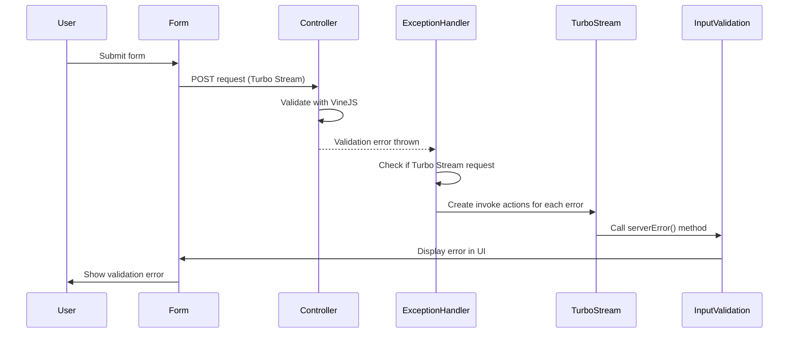

# Design Document

## Overview

This design integrates server-side validation errors with the existing client-side validation system using Turbo Streams and Stimulus controllers. The solution extends the current `InputValidationController` with a `serverError()` method and enhances the exception handler to detect validation errors and respond with targeted Turbo Stream updates.

## Architecture

### High-Level Flow

1. **Form Submission**: User submits form via Turbo Stream
2. **Server Validation**: Controller validates data using VineJS validators
3. **Error Detection**: Exception handler catches validation errors
4. **Turbo Stream Response**: Handler returns Turbo Stream with invoke actions
5. **Client-Side Display**: Stimulus controller displays errors using existing validation UI

### Component Interaction



## Components and Interfaces

### 1. Enhanced Exception Handler

**File**: `app/exceptions/handler.ts`

The exception handler will be extended to:
- Detect validation errors (VineJS validation exceptions)
- Check if the request is a Turbo Stream request
- Generate Turbo Stream responses with invoke actions for each validation error
- Map validation error field names to form input IDs

**Key Methods**:
- `handleValidationError(error, ctx)`: Process validation errors specifically
- `createValidationTurboStream(errors, ctx)`: Generate Turbo Stream responses
- `mapFieldToInputId(fieldName)`: Convert field names to input element IDs

### 2. Extended InputValidationController

**File**: `resources/js/controllers/input_validation.ts`

**New Method**: `serverError(fieldName: string, message: string)`
- Accepts field name and error message
- Finds the corresponding input element
- Marks input as dirty and invalid
- Displays error message in feedback element
- Uses existing validation UI logic

**Integration Points**:
- Reuses existing `validateInput()` logic for consistent styling
- Maintains compatibility with client-side validation state
- Preserves existing event listeners and validation flow

### 3. Enhanced TurboStream Class

**File**: `providers/turbo/turbo_stream.ts`

**New Method**: `invoke(target: string, method: string, args: any[])`
- Creates Turbo Stream invoke actions
- Supports method calls with parameters
- Targets specific DOM elements with Stimulus controllers

**Implementation**:
```typescript
invoke(target: string, method: string, args: any[] = []) {
  const template = this.from('', {}, { 
    action: 'invoke', 
    target, 
    method, 
    args: JSON.stringify(args) 
  })
  this.templates.push(template)
  return this
}
```

### 4. Turbo Stream Invoke Action Support

**Client-Side Enhancement**: Support for processing invoke actions in Turbo Streams

The client will need to handle the custom `invoke` action by:
- Parsing the target selector
- Finding the Stimulus controller instance
- Calling the specified method with provided arguments

## Data Models

### Validation Error Structure

```typescript
interface ValidationError {
  field: string      // Field name from validator
  message: string    // Error message
  rule: string       // Validation rule that failed
}

interface ServerErrorArgs {
  fieldName: string  // Input field identifier
  message: string    // User-friendly error message
}
```

### Turbo Stream Invoke Directive

```typescript
interface InvokeDirective extends TurboDirectives {
  action: 'invoke'
  target: string     // CSS selector for target element
  method: string     // Method name to call
  args?: string      // JSON-stringified arguments array
}
```

## Error Handling

### Exception Handler Error Processing

1. **Validation Error Detection**: Check if error is instance of VineJS validation error
2. **Request Type Check**: Verify if request accepts Turbo Stream responses
3. **Fallback Behavior**: If not Turbo Stream, use existing error handling (redirects with flash messages)
4. **Error Mapping**: Convert validation field names to form input identifiers

### Client-Side Error Handling

1. **Method Invocation Errors**: Graceful handling if Stimulus controller method doesn't exist
2. **Argument Parsing Errors**: Safe JSON parsing with fallback to empty arguments
3. **DOM Element Missing**: Skip processing if target element not found
4. **Controller Missing**: Skip processing if Stimulus controller not attached

### Integration with Existing Validation

1. **State Preservation**: Server errors don't interfere with client-side validation state
2. **Error Clearing**: Client-side validation can clear server errors when input becomes valid
3. **Dirty State Management**: Server errors mark inputs as dirty for subsequent client validation

## Testing Strategy

### Unit Tests

1. **Exception Handler Tests**:
   - Test validation error detection
   - Test Turbo Stream response generation
   - Test field name mapping

2. **InputValidationController Tests**:
   - Test `serverError()` method functionality
   - Test integration with existing validation logic
   - Test error display and clearing

3. **TurboStream Tests**:
   - Test `invoke()` method
   - Test argument serialization
   - Test template generation

### Integration Tests

1. **End-to-End Form Validation**:
   - Submit form with server validation errors
   - Verify error display matches client-side styling
   - Test error clearing on subsequent input

2. **Mixed Validation Scenarios**:
   - Forms with both client and server validation
   - Error state transitions
   - Multiple field validation errors

### Manual Testing Scenarios

1. **User Registration Form**: Test email already exists scenario
2. **Employee Form**: Test server-side business rule validation
3. **Network Failure**: Test graceful degradation when Turbo Stream fails

## Implementation Notes

### Field Name Mapping

The system needs to map validation field names to form input IDs:
- Simple fields: `email` → `#email`
- Nested fields: `user.email` → `#user-email`
- Array fields: `items.0.name` → `#items-0-name`

### Turbo Stream Invoke Action

Since Turbo doesn't natively support invoke actions, we'll need to:
1. Extend Turbo Stream processing to handle custom actions
2. Add event listener for custom invoke actions
3. Parse and execute method calls safely

### Backward Compatibility

The solution maintains full backward compatibility:
- Existing client-side validation continues to work unchanged
- Non-Turbo Stream requests use existing error handling
- Forms without client-side validation still receive server errors via flash messages