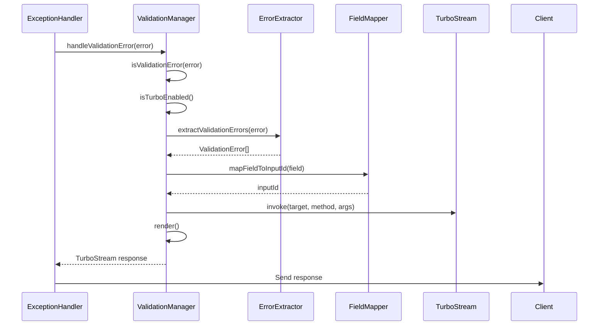

# Design Document

## Overview

This design refactors the existing server validation integration into a clean, structured `ValidationManager` class within the Turbo provider. The ValidationManager encapsulates all validation error handling logic, provides a fluent API for common validation scenarios, and is structured for easy extraction as a standalone package.

## Architecture

### High-Level Structure

```
providers/turbo/
├── validation/
│   ├── validation_manager.ts          # Main ValidationManager class
│   ├── types.ts                       # TypeScript type definitions
│   ├── field_mapper.ts                # Field name to input ID mapping logic
│   └── error_extractor.ts             # VineJS error extraction logic
├── turbo_provider.ts                  # Updated to bind ValidationManager
└── turbo_stream.ts                    # Existing TurboStream class
```

### Component Interaction



## Components and Interfaces

### 1. ValidationManager Class

**File**: `providers/turbo/validation/validation_manager.ts`

The main class that orchestrates all validation error handling:

```typescript
export class ValidationManager {
  constructor(
    private ctx: HttpContext,
    private turboStream: TurboStream,
    private errorExtractor: ErrorExtractor,
    private fieldMapper: FieldMapper
  )

  // Main method for handling validation errors
  async handleValidationError(error: unknown): Promise<string>

  // Utility methods
  isValidationError(error: unknown): boolean
  isTurboEnabled(): boolean

  // Manual validation error triggering
  addFieldError(fieldName: string, message: string): ValidationManager

  // Fluent API methods
  withCustomMapping(mapper: (field: string) => string): ValidationManager
  withErrorTransform(transform: (error: ValidationError) => ValidationError): ValidationManager
}
```

### 2. Error Extractor

**File**: `providers/turbo/validation/error_extractor.ts`

Handles extraction of validation errors from different error formats:

```typescript
export class ErrorExtractor {
  extractValidationErrors(error: unknown): ValidationError[]

  private extractFromVineJS(error: any): ValidationError[]
  private extractFromMessages(messages: any[]): ValidationError[]
  private extractFromErrorObject(errorObj: any): ValidationError[]
}
```

### 3. Field Mapper

**File**: `providers/turbo/validation/field_mapper.ts`

Handles mapping of validation field names to form input IDs:

```typescript
export class FieldMapper {
  mapFieldToInputId(fieldName: string): string

  private handleNestedFields(fieldName: string): string
  private handleArrayFields(fieldName: string): string
  private cleanupFieldName(fieldName: string): string
}
```

### 4. Enhanced Turbo Provider

**File**: `providers/turbo/turbo_provider.ts`

Updated to bind the ValidationManager to the HttpContext:

```typescript
export default class TurboProvider {
  async boot() {
    // Existing turbo bindings...

    // Bind ValidationManager to HttpContext
    HttpContext.macro('validationManager', function () {
      return new ValidationManager(this, this.turboStream, new ErrorExtractor(), new FieldMapper())
    })
  }
}
```

## Data Models

### Core Types

**File**: `providers/turbo/validation/types.ts`

```typescript
export interface ValidationError {
  field: string
  message: string
  rule?: string
}

export interface ValidationManagerConfig {
  customFieldMapper?: (field: string) => string
  errorTransform?: (error: ValidationError) => ValidationError
  fallbackBehavior?: 'flash' | 'throw' | 'silent'
}

export interface FieldMappingRule {
  pattern: RegExp
  replacement: string
}

export type ValidationErrorHandler = (error: unknown) => Promise<string>
export type FieldMapper = (fieldName: string) => string
export type ErrorTransform = (error: ValidationError) => ValidationError
```

### HttpContext Extension

```typescript
declare module '@adonisjs/core/http' {
  interface HttpContext {
    validationManager: ValidationManager
  }
}
```

## Error Handling

### Validation Error Detection

The ValidationManager provides robust error detection:

1. **VineJS Error Detection**: Checks for `E_VALIDATION_ERROR` code
2. **Structure Validation**: Validates error object structure
3. **Fallback Handling**: Graceful handling of unknown error formats

### Turbo Stream Detection

Enhanced detection logic:

1. **Accept Header Check**: Looks for Turbo Stream MIME type
2. **Turbo Frame Check**: Detects Turbo Frame requests
3. **Custom Header Support**: Allows custom Turbo detection headers

### Error Processing Pipeline

1. **Error Validation**: Confirm error is a validation error
2. **Context Check**: Verify Turbo Stream support
3. **Error Extraction**: Extract individual field errors
4. **Field Mapping**: Map field names to input IDs
5. **Response Generation**: Create Turbo Stream response
6. **Fallback Handling**: Handle non-Turbo requests gracefully

## API Design

### Simple Usage (Exception Handler)

```typescript
// Before (complex logic in exception handler)
if (this.isValidationError(error) && this.isTurboEnabled(ctx)) {
  const turbo = await this.handleValidationError(error, ctx)
  return ctx.response.send(turbo)
}

// After (clean one-liner)
if (ctx.validationManager.isValidationError(error) && ctx.validationManager.isTurboEnabled()) {
  return ctx.response.send(await ctx.validationManager.handleValidationError(error))
}
```

### Advanced Usage (Custom Validation)

```typescript
// Manual field error addition
await ctx.validationManager
  .addFieldError('email', 'Email already exists')
  .addFieldError('username', 'Username is taken')
  .handleValidationError(new Error('Custom validation'))

// Custom field mapping
await ctx.validationManager
  .withCustomMapping((field) => `custom-${field}`)
  .handleValidationError(error)

// Error transformation
await ctx.validationManager
  .withErrorTransform((error) => ({
    ...error,
    message: `Custom: ${error.message}`,
  }))
  .handleValidationError(error)
```

### Controller Usage

```typescript
// In controllers for manual validation
export default class UsersController {
  async store({ request, response, validationManager }: HttpContext) {
    try {
      // Validation logic...
    } catch (error) {
      if (validationManager.isTurboEnabled()) {
        return response.send(await validationManager.handleValidationError(error))
      }
      // Fallback handling...
    }
  }
}
```

## Package Structure for Publishing

### Directory Organization

```
@adonisjs/turbo-validation/
├── src/
│   ├── validation_manager.ts
│   ├── error_extractor.ts
│   ├── field_mapper.ts
│   ├── types.ts
│   └── index.ts
├── providers/
│   └── validation_provider.ts
├── package.json
├── tsconfig.json
└── README.md
```

### Export Strategy

```typescript
// src/index.ts
export { ValidationManager } from './validation_manager.js'
export { ErrorExtractor } from './error_extractor.js'
export { FieldMapper } from './field_mapper.js'
export * from './types.js'

// Main export for easy importing
export { default as ValidationProvider } from '../providers/validation_provider.js'
```

### Configuration Support

```typescript
// config/validation.ts (for future package)
export default {
  fieldMapping: {
    customRules: [
      { pattern: /^user\./, replacement: 'user-' },
      { pattern: /\[(\d+)\]/, replacement: '-$1' },
    ],
  },
  errorTransforms: {
    // Custom error message transformations
  },
  fallbackBehavior: 'flash' as const,
}
```

## Integration Points

### Existing Code Compatibility

1. **Exception Handler**: Minimal changes required, just replace complex logic with ValidationManager calls
2. **TurboStream**: No changes needed, ValidationManager uses existing TurboStream API
3. **Client-Side**: No changes needed, same invoke actions and method calls
4. **Forms**: No changes needed, same field naming and validation attributes

### Provider Integration

1. **Turbo Provider**: Enhanced to bind ValidationManager to context
2. **Service Container**: ValidationManager dependencies properly resolved
3. **Type System**: Full TypeScript support with proper declarations

### Testing Strategy

1. **Unit Tests**: Each component (ValidationManager, ErrorExtractor, FieldMapper) tested independently
2. **Integration Tests**: Full validation flow from error to client response
3. **Compatibility Tests**: Ensure existing functionality remains unchanged
4. **Package Tests**: Test extraction and standalone usage

## Migration Path

### Phase 1: Create ValidationManager Structure

- Implement ValidationManager class with existing logic
- Create ErrorExtractor and FieldMapper classes
- Add TypeScript types and interfaces

### Phase 2: Integrate with Provider

- Update TurboProvider to bind ValidationManager
- Add HttpContext macro for easy access
- Ensure proper dependency injection

### Phase 3: Refactor Exception Handler

- Replace complex validation logic with ValidationManager calls
- Maintain backward compatibility
- Add comprehensive error handling

### Phase 4: Package Preparation

- Structure code for easy extraction
- Add comprehensive documentation
- Create example usage and migration guides

## Performance Considerations

### Lazy Loading

- ValidationManager instantiated only when needed
- Error extraction optimized for common VineJS patterns
- Field mapping cached for repeated operations

### Memory Management

- Minimal object creation during error processing
- Reuse of TurboStream instances
- Efficient error object traversal

### Scalability

- Stateless design for easy horizontal scaling
- No global state or singletons
- Thread-safe error processing
